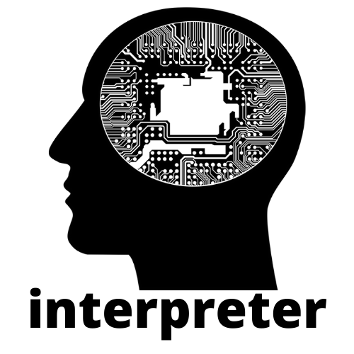

  
Welcome!
Tired of fixing compiler errors?  
Do you keep forgetting the semicolon?  
Are you missing the capabilities of your favorite programming language?   

We will help you! Let's write an interpreter for our own programming language, and no one but us can give us errors.

<cut />
 

### This interpreter can:
 * Read code from file;
 * Divide the code into tokens by creating an infix notation;
 * Build a postfix record based on an infix record;
 * Work with arithmetic operators;
 * Handle the assignment operator;
 * Work with logical operators;
 * Realize the work of the transport operator (goto);
 * Handle a conditional statement;
 * Work with a while cycle. 
