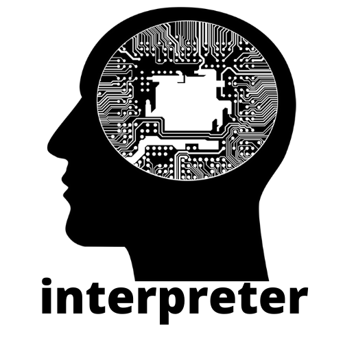

# interpreter
  Welcome!
Tired of fixing compiler errors?
Do you keep forgetting the semicolon?
Are you missing the capabilities of the programming language you are working in?

We will help you! Let's write an interpreter for our own programming language, and no one but us can give us errors.

<cut />
 
